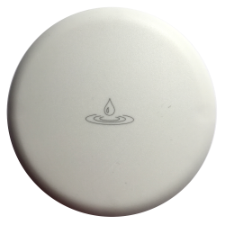
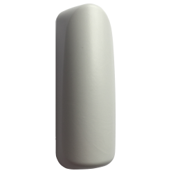
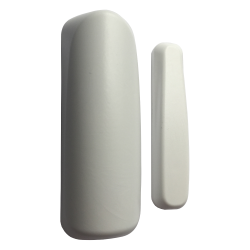
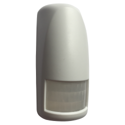
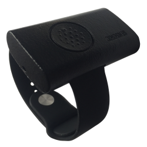
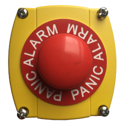
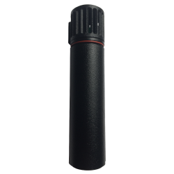

# Specifikace předávání událostí

Dokument popisuje způsob předávání událostí ze systému SENSORIC do aplikace partnera.

**Způsob komunikace je mezi SENSORIC a partnerem dohodnut a na straně SENSORIC nastaven.** V budoucnu bude umožněno
partnerovi aby si sám nastavení měnil ve webovém rozhraní nebo přes API.

## Obsah

Obsah můžete zobrazit následujícím způsobem:


# Způsoby předávání dat

Data jsou předávána komunikačním protokolem ve formátu JSON a popisují události, které vznikají v systému SENSORIC.
Položky datetime jsou v UTC podle ISO 8601. Pořadí parametrů není zaručeno a může se měnit.

## Předávání událostí přes HTTP callback

Partner může specifikovat URL endpointů na které jsou události zasílány formou HTTP(S) POST requestů. Requesty mají
kódování UTF-8 a Content-Type “application/json”. Systém se snaží předat události v režimu at-least-once, může tedy
nastat situace že je událost doručena víckrát. Tuto situaci lze ošetři s využitím položky EventId, která obsahuje
identifikátor události.

### URL HTTP requestu

Do URL je možné vložit zástupné parametry, které budou nahrazeny odpovídající hodnotou.

| Parametr          | Popis                         |
| :-----------------|:------------------------------|
| ProtocolVersion   | verze komunikačního protokolu |
| DeviceId          | identifikátor senzoru         |
| MessageType       | typ zprávy                    |
| EventType         | typ události                  |

Příklad URL (doporučené nastavení):

`https://nejakaadresa.cz/event/v{ProtocolVersion}/{DeviceId}/{MessageType}/{EventType}/`

Pro uvedenou URL budou volány např. tyto requesty:

https://nejakaadresa.cz/event/v1/abc123/magnetic-simple/alert-start/

https://nejakaadresa.cz/event/v1/abc123/thermometer-average/measured/

### Hlavičky HTTP requestu
Partner může specifikovat další konfiguraci přidáním HTTP hlavičy (klíč a hodnota). Tím lze např. vyřešit autorizaci.

### Odpověď na HTTP request

Systém očekává v odpovědi HTTP status 200-299, kterým partner potvrdí přijetí události. Jiná odpověď je vyhodnocena jako nedoručení.

### Chování v případě nedoručení události
 V případě, že se nepodaří událost předat, systém pokus 10x opakuje s 5s prodlevami. Následně je událost zahozena.

# Komunikační protokol
Data jsou odesílána vždy jako samostatné události. Události mají společnou část parametrů.

Společné parametry:

| Parametr          | Typ     | Popis                         |
| :-----------------|:--------|:------------------------------|
| ProtocolVersion   | integer | verze komunikačního protokolu |
| DeviceId          | string  | identifikátor senzoru         |
| EventId           | string  | identifikátor události        |
| EventTime         | string  | čas události                  |
| MessageType       | string  | typ zprávy                    |
| EventType         | string  | typ události                  |

Další případné parametry neuvedené v tabulce jsou závislé na typu zprávy a události.

# Zařízení a podporované události

## Zařízení WaterDetection
Detekuje přítomnost vody v ohraničeném prostoru. 



### Režim Continuous
Pokud v klidovém stavu dojde k zaplavení, je vyvolána událost `alert-start`. Následně kontroluje každou minutu zda zaplavení trvá a pokud trvá, tak po 10 minutách vyvolá událost `alert-continue`. Pokud i nadále zaplavení pokračuje pošle po dalších 10 minutách událost `alert-continue`, že zaplavení pokračuje, další již neposílá. Po skončení zaplavení zařízení posílá `alert-end`.

> MessageType: water-detection-continuous

| EventType                                     | Popis |
|:----------------------------------------------|:------|
| [restart](#eventtype-restart)                 | Restart zařízení. |
| [alive](#eventtype-alive)                     | Nastává v pravidelném intervalu, potvrzuje funkčnost zařízení. |
| [transport](#eventtype-transport)             | Přechod do transportního režimu - neaktivní stav s minimální spotřebou. |
| [alert-start](#eventtype-alert-start)         | Detekce vzniku zaplavení. |
| [alert-continue](#eventtype-alert-continue)   | Zaplavení pokračuje. |
| [alert-continue-end](#eventtype-alert-continue-end)             | Konec zaplavení. |

## Zařízení MovementDetection
Detekuje pohyb předmětu, na kterém je čidlo připevněno nebo položeno. 



### Režim Continuous
Pro případy, kdy chceme být informováni o tom, že se nějaký předmět pohnul. Například dveře, okno, kancelářský šuplík, taška, auto, motocykl, kolo, kočárek, batoh, kufr …

Pokud v klidovém stavu dojde pohybu, je vyvolána událost `alert-start`. Pokud v následujících 10 minutách znovu dojde k pohybu tak počítá opakování pohybu a po 10 minutách pošle `alert-continue`. `alert-continue` se opakuje dokud dochází k pohybu. Pokud je zařízení 10 minut od začátku nebo pokračování pohybu v klidu, posílá `alert-end`.

> MessageType: movement-detection-continuous

| EventType                                     | Popis |
|:----------------------------------------------|:------|
| [restart](#eventtype-restart)                 | Restart zařízení. |
| [alive](#eventtype-alive)                     | Nastává v pravidelném intervalu, potvrzuje funkčnost zařízení. |
| [transport](#eventtype-transport)             | Přechod do transportního režimu - neaktivní stav s minimální spotřebou. |
| [tamper-open](#eventtype-tamper-open)         | Otevření krytu zařízení, rozepnutí bezpečnostního spínače. |
| [tamper-closed](#eventtype-tamper-closed) *   | Uzavření krytu zařízení, sepnutí bezpečnostního spínače. |
| [alert-start](#eventtype-alert-start)         | Detekce začátku pohybu. |
| [alert-continue](#eventtype-alert-continue)   | Bohyb pokračuje. |
| [alert-continue-end](#eventtype-alert-continue-end)             | Během 10 minut nedošlo k pohybu. |

\* tamper-closed aktuální verze senzorů nepodporuje

## Zařízení Magnetic
Rozpozná oddálení/přiblížení čidla od magnetu.



### Režim Simple
Pro identifikaci, že došlo k otevření/zavření skříní, oken, dveří nebo pro identifikaci vzdálení se nějakého předmětu od jiného.

Vždy při oddálení magnetu je vyvolána událost `alert-start`. Při přiblížení magnetu zpět vyvolá `alert-end`.

> MessageType: magnetic-detection-simple

| EventType                                           | Popis |
|:----------------------------------------------------|:------|
| [restart](#eventtype-restart)                       | Restart zařízení. |
| [alive](#eventtype-alive)                           | Nastává v pravidelném intervalu, potvrzuje funkčnost zařízení. |
| [transport](#eventtype-transport)                   | Přechod do transportního režimu - neaktivní stav s minimální spotřebou. |
| [tamper-open](#eventtype-tamper-open)               | Otevření krytu zařízení, rozepnutí bezpečnostního spínače. |
| [tamper-closed](#eventtype-tamper-closed) *         | Uzavření krytu zařízení, sepnutí bezpečnostního spínače. |
| [alert-start](#eventtype-alert-start)               | Magnet oddálen, začátek poplachu. |
| [alert-end](#eventtype-alert-end-pro-režimy-simple) | Magnet přiblížen zpět, konec poplachu. |

\* tamper-closed aktuální verze senzorů nepodporuje

### Režim Continuous
Pro sledování četnosti otevření/zavření dveří, krytů, průchodu pohyblivých částí.

Pokud v klidovém stavu dojde k oddálení magnetu, je vyvolána událost `alert-start`. Na přiblížení magnetu nijak nereaguje, ale pokud dojde do 10 minut k opětovnému oddálení magnetu tak počítá kolikrát se oddálil a po 10 minutách pošle `alert-continue`. `alert-continue` se opakuje dokud se něco děje. Pokud se během 10 minut nic nestane (nedojde k oddálení magnetu), zařízení posílá `alert-end`.

> MessageType: magnetic-detection-continuous

| EventType                                     | Popis |
|:----------------------------------------------|:------|
| [restart](#eventtype-restart)                 | Restart zařízení. |
| [alive](#eventtype-alive)                     | Nastává v pravidelném intervalu, potvrzuje funkčnost zařízení. |
| [transport](#eventtype-transport)             | Přechod do transportního režimu - neaktivní stav s minimální spotřebou. |
| [tamper-open](#eventtype-tamper-open)         | Otevření krytu zařízení, rozepnutí bezpečnostního spínače. |
| [tamper-closed](#eventtype-tamper-closed) *   | Uzavření krytu zařízení, sepnutí bezpečnostního spínače. |
| [alert-start](#eventtype-alert-start)         | Magnet oddálen, začátek poplachu. |
| [alert-continue](#eventtype-alert-continue)   | Dění na magnetu se opakuje, poplach pokračuje. |
| [alert-continue-end](#eventtype-alert-continue-end)             | Během 10 minut nedošlo k oddálení magnetu, konec poplachu. |

\* tamper-closed aktuální verze senzorů nepodporuje

## Zařízení Pir
Detekuje pohyb nebo přítomnost člověka ve vymezeném prostoru do vzdálenosti 10m. 



### Režim Continuous
Pro identifikaci, že se v místnosti nebo ohraničeném prostoru pohybuje člověk, kdy a jak často. 

Jakmile senzor detekuje pohyb pošle zprávu s událostí `alert-start`. Pokud i nadále detekuje pohyb, posílá v 10 minutových intervalech zprávy s událostí `alert-continue`, že pohyb pokračuje, kolik pohybů zaznamenal a kdy nastal poslední. Senzor pošle zprávu s událostí `alert-end`, že pohyb skončil pokud 10 minut nenastane žádný pohyb.

> MessageType: pir-continuous

| EventType                                     | Popis |
|:----------------------------------------------|:------|
| [restart](#eventtype-restart)                 | Restart zařízení. |
| [alive](#eventtype-alive)                     | Nastává v pravidelném intervalu, potvrzuje funkčnost zařízení. |
| [transport](#eventtype-transport)             | Přechod do transportního režimu - neaktivní stav s minimální spotřebou. |
| [tamper-open](#eventtype-tamper-open)         | Otevření krytu zařízení, rozepnutí bezpečnostního spínače. |
| [tamper-closed](#eventtype-tamper-closed) *   | Uzavření krytu zařízení, sepnutí bezpečnostního spínače. |
| [alert-start](#eventtype-alert-start)         | Detekce začátku pohybu. |
| [alert-continue](#eventtype-alert-continue)   | Bohyb pokračuje. |
| [alert-continue-end](#eventtype-alert-continue-end)             | Během 10 minut nedošlo k pohybu. |

\* tamper-closed aktuální verze senzorů nepodporuje

## Zařízení AlertButton
Zařízení s tlačítkem pro přivolání pomoci nebo spuštění poplachu.




### Režim Simple
Zařízení po stitknutí tlačítka pošle zprávu s událostí `alert-start`.

> MessageType: alert-button-simple

| EventType                                     | Popis |
|:----------------------------------------------|:------|
| [restart](#eventtype-restart)                 | Restart zařízení. |
| [alive](#eventtype-alive)                     | Nastává v pravidelném intervalu, potvrzuje funkčnost zařízení. |
| [transport](#eventtype-transport)             | Přechod do transportního režimu - neaktivní stav s minimální spotřebou. |
| [alert-start](#eventtype-alert-start)         | Stisknuto, začátek poplachu. |

## Zařízení Thermometer
Měří teplotu okolního prostředí.



### Režim Average
Každou minutu měří teplotu. Po X měření provede výpočet průměrné hodnoty a odešle událost `measured-temperature`.

> MessageType: thermometer-average

| EventType                                   | Popis |
|:--------------------------------------------|:------|
| [restart](#eventtype-restart)               | Restart zařízení. |
| [alive](#eventtype-alive)                   | Nastává v pravidelném intervalu, potvrzuje funkčnost zařízení. |
| [transport](#eventtype-transport)           | Přechod do transportního režimu - neaktivní stav s minimální spotřebou. |
| [measured-temperature](#eventtype-measured-temperature) | Naměřené veličiny. |

### EventType measured-temperature
Nastává při odeslání naměřené hodnoty.

Dodatečné předávané parametry:
| Parametr          | Typ     | Povinný | Popis
| :-----------------|:--------|:--------|:-----
| Temperature       | float   | ano     | naměřená teplota

Ukázka zaslané události:
```yaml
{
    "ProtocolVersion": 1,
    "DeviceId": "abc123",
    "MessageType": "thermometer-average",
    "EventId": "c4056fc4-d433-4d2c-bb7f-23a691fd3dac",
    "EventTime": "2021-05-03T14:25:31.8437511Z",
    "EventType": "measured-temperature",
    "Temperature": 25.5
}
```

## Zařízení HumidityMeter
Měří teplotu a vlhkost okolního prostředí.


### Režim Average
Každou minutu měří teplotu a vlhkost. Po X měření provede výpočet průměrné hodnoty a odešle událost `measured-humidity-temperature`.

> MessageType: humidity-meter-average

| EventType                                   | Popis |
|:--------------------------------------------|:------|
| [restart](#eventtype-restart)               | Restart zařízení. |
| [alive](#eventtype-alive)                   | Nastává v pravidelném intervalu, potvrzuje funkčnost zařízení. |
| [transport](#eventtype-transport)           | Přechod do transportního režimu - neaktivní stav s minimální spotřebou. |
| [measured-humidity-temperature](#eventtype-measured-humidity-temperature) | Naměřené veličiny. |

### EventType measured-humidity-temperature
Nastává při odeslání naměřené hodnoty.

Dodatečné předávané parametry:
| Parametr          | Typ     | Povinný | Popis
| :-----------------|:--------|:--------|:-----
| Temperature       | float   | ano     | naměřená teplota
| Humidity          | float   | ano     | naměřená vlhkost

Ukázka zaslané události:
```yaml
{
    "ProtocolVersion": 1,
    "DeviceId": "abc123",
    "MessageType": "humidity-meter-average",
    "EventId": "c4056fc4-d433-4d2c-bb7f-23a691fd3dac",
    "EventTime": "2021-05-03T14:25:31.8437511Z",
    "EventType": "measured-humidity-temperature",
    "Temperature": 25.5,
    "Humidity": 27.5
}
```

# Společné události
Události na ktré je odkázáno z konkrétních typů zpráv.

## EventType restart
Nastává při restartu zařízení. K restartu může dojít stiskem restartovacího tlačítka umístěného na plošném spoji čidla nebo restart může vyvolat firmware čidla při hardwarové chybě nebo u některých změn konfigurace čidla pomocí příkazu zaslaného prostřednictvím downlink API.

Ukázka zaslané události:
```yaml
{
    "ProtocolVersion": 1,
    "DeviceId": "abc123",
    "MessageType": "magnetic-detection-simple",
    "EventId": "c4056fc4-d433-4d2c-bb7f-23a691fd3dac",
    "EventTime": "2021-05-03T14:25:31.8437511Z",
    "EventType": "restart"
}
```

## EventType alive
Nastává v pravidelném intervalu, potvrzuje funkčnost zařízení.

Ukázka zaslané události:
```yaml
{
    "ProtocolVersion": 1,
    "DeviceId": "abc123",
    "MessageType": "magnetic-detection-simple",
    "EventId": "c4056fc4-d433-4d2c-bb7f-23a691fd3dac",
    "EventTime": "2021-05-03T14:25:31.8437511Z",
    "EventType": "alive"
}
```

## EventType transport
Nastává při přechodu senzoru do transportního režimu, ke kterému dojde po vložení nové baterie nebo pomocí příkazu zaslaného prostřednictvím downlink API.

Čidlo v transportním režimu má velmi nízkou spotřebu a neposílá žádné zprávy. Pro probuzení čidla z transportního režimu je třeba stisknout RESET tlačítko umístěné na plošném spoji čidla.

Ukázka zaslané události:
```yaml
{
    "ProtocolVersion": 1,
    "DeviceId": "abc123",
    "MessageType": "magnetic-detection-simple",
    "EventId": "c4056fc4-d433-4d2c-bb7f-23a691fd3dac",
    "EventTime": "2021-05-03T14:25:31.8437511Z",
    "EventType": "transport"
}
```

## EventType downlink-acknowledge
Informuje o doručení downlinkového commandu na zařízení.

Ukázka zaslané události:
```yaml
{
    "ProtocolVersion": 1,
    "DeviceId": "abc123",
    "MessageType": "magnetic-detection-simple",
    "EventId": "c4056fc4-d433-4d2c-bb7f-23a691fd3dac",
    "EventTime": "2021-05-03T14:25:31.8437511Z",
    "EventType": "downlink-acknowledge"
}
```

## EventType tamper-open
Nastává při rozepnutí tamperu - otevření krytu senzoru.

Ukázka zaslané události:
```yaml
{
    "ProtocolVersion": 1,
    "DeviceId": "abc123",
    "MessageType": "magnetic-detection-simple",
    "EventId": "c4056fc4-d433-4d2c-bb7f-23a691fd3dac",
    "EventTime": "2021-05-03T14:25:31.8437511Z",
    "EventType": "tamper-open"
}
```

## EventType tamper-closed
Nastává při sepnutí tamperu - zavření krytu senzoru.

Ukázka zaslané události:
```yaml
{
    "ProtocolVersion": 1,
    "DeviceId": "abc123",
    "MessageType": "magnetic-detection-simple",
    "EventId": "c4056fc4-d433-4d2c-bb7f-23a691fd3dac",
    "EventTime": "2021-05-03T14:25:31.8437511Z",
    "EventType": "tamper-closed"
}
```

## EventType alert-start
Nastává při prvním vzniku události jako např. zaplavení kontaktů, oddálení magnetu, zaregistrování pohybu.

Ukázka zaslané události:
```yaml
{
    "ProtocolVersion": 1,
    "DeviceId": "abc123",
    "MessageType": "magnetic-detection-simple",
    "EventId": "c4056fc4-d433-4d2c-bb7f-23a691fd3dac",
    "EventTime": "2021-05-03T14:25:31.8437511Z",
    "EventType": "alert-start"
}
```

## EventType alert-continue
Nastává pokud událost pokračuje.

Ukázka zaslané události:
```yaml
{
    "ProtocolVersion": 1,
    "DeviceId": "abc123",
    "MessageType": "magnetic-detection-simple",
    "EventId": "c4056fc4-d433-4d2c-bb7f-23a691fd3dac",
    "EventTime": "2021-05-03T14:25:31.8437511Z",
    "EventType": "alert-continue",
    "AlertCount": 0,
    "SecondsSinceLastAlert": 0
}
```

`AlertCount` udává počet opakování události od posledního odeslání `alert-start` nebo `alert-continue`.

`SecondsSinceLastAlert` udává počet vteřin mezi podlední událostí a odesláním zprávy.

## EventType alert-continue-end
Situace kdy událost nastane je popsána u každého zařízení, které tuto událost zasílá.

> MessageType u kterých může tato událost nastat: `water-detection-continuous`, `movement-detection-continuous`, `magnetic-detection-continuous`, `pir-continuous`

Ukázka zaslané události:
```yaml
{
    "ProtocolVersion": 1,
    "DeviceId": "abc123",
    "MessageType": "magnetic-detection-continuous",
    "EventId": "c4056fc4-d433-4d2c-bb7f-23a691fd3dac",
    "EventTime": "2021-05-03T14:25:31.8437511Z",
    "EventType": "alert-continue-end",
    "AlertCount": 0,
    "SecondsSinceLastAlert": 0
}
```

`AlertCount` udává počet opakování události od posledního odeslání `alert-start` nebo `alert-continue`.

`SecondsSinceLastAlert` udává počet vteřin mezi podlední událostí a odesláním zprávy.

## EventType alert-end
Situace kdy událost nastane je popsána u každého zařízení, které tuto událost zasílá.

> MessageType u kterých může tato událost nastat: `magnetic-detection-simple`

Ukázka zaslané události:
```yaml
{
    "ProtocolVersion": 1,
    "DeviceId": "abc123",
    "MessageType": "magnetic-detection-simple",
    "EventId": "c4056fc4-d433-4d2c-bb7f-23a691fd3dac",
    "EventTime": "2021-05-03T14:25:31.8437511Z",
    "EventType": "alert-end"
}
```
